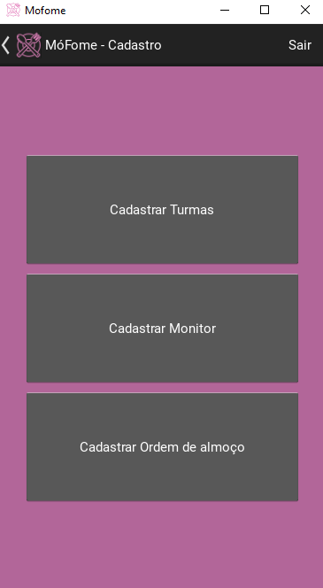

<h1>App MóFome</h1>

<h2>Resumo</h2>
O seguinte trabalho foi desenvolvido para a matéria de Projeto Interdisciplinar para Sistemas de Informação I, presente na grade curricular do primeiro período do curso de 
<strong>Sistemas de Informação da Universidade Federal Rural de Pernambuco (UFRPE)</strong> e tem como linguagem utilizada o Python junto ao Kivy, framework utilizado para criação de 
aplicativos. A ideia do App surgiu ao se notar a forma com que as escolas que ofertam merenda controlam o processo das filas de alunos no refeitório, sendo bastante bagunçado e quase 
totalmente manual. Portanto, o aplicativo busca resolver essa desorganização. Já a ideia do nome veio da junção das iniciais do tema, surgindo <strong>MóFome</strong>.

<h2>Tema</h2>
Monitoramento de fila de merenda escolar. 

<h2>Objetivo</h2>
Servir como gerenciador de fluxo de fila para a merenda escolar, organizando e controlando os alunos no refeitório da escola. 

<h2>Funcionalidades</h2>
Cadastro de Turmas, Monitores e Ordem da Fila; Registro do Dia; Relatório Semanal
<h3>Cadastro de Turmas</h3>
Nome da turma e quantidade de alunos, crucial tanto na tela de Cadastro de Ordem da Fila, como também no Registro do Dia e no Relatório da Semana.
<h3>Cadastro de Monitores</h3>
Nome do aluno monitor, sendo relevante no registro do dia.
<h3>Cadastro de Ordem da Fila</h3>
Ordena as turmas por dia da semana, importante no registro do dia por turma. 
<h3>Registro do Dia</h3>
No registro do dia há a captura dos seguintes dados:

  - Data
  - Dia da Semana
  - Almoço
  - Monitor
  - Quantidade de alunos por turma e por sexo biológico 

<h3>Relatório Semanal</h3>
O Relatório da Semana apresenta um gráfico de setores e duas tabelas. O gráfico de setores mostra a média de Meninos e Meninas que almoçaram na semana. Aqui ocorre uma média aritmética, onde soma-se a quantidade de Meninos e Meninas de todas as salas, por dia, e divide por 5 (já que leva-se em conta os dias de segunda-feira a sexta-feira). Disso, é extraído a porcentagem. O relatório mostra também, em tabela, o dia da semana que menos alunos almoçaram e o dia que mais alunos almoçaram. Ainda, em outra tabela, é mostrado o Ranking das 3 turmas que mais almoçaram na semana, levando em consideração a seguinte fórmula: quantidade que almoçou dividido pela quantidade total de alunos da turma. Nesse caso, o cálculo é realizado com base na quantidade de pessoas da turma, não numa média geral. 

<h2>Telas do Projeto</h2>
<h3>Tela de Menu</h3>

<h3>Tela de Cadastro</h3>

<h3>Tela de Cadastro de Turmas</h3>

<h3>Tela de Cadastro de Monitores</h3>

<h3>Tela de Cadastro de Ordem de Turmas</h3>

<h3>Tela de Registro do Dia</h3>

<h3>Tela de Relatório Semanal</h3>

<h2>Estrutura do Projeto</h2>
<h3>Principais Bibliotecas Utilizadas</h3>

  - kivy: para a interface do aplicativo.
  - openpyxl: para manipulação de arquivos Excel.
  - matplotlib: para a geração de gráficos e tabelas.
  - kivy_garden.matplotlib: para a integração dos gráficos com Kivy.
  - numpy: para realizar cálculos que demanda muito processamento de maneira rápida.
  - datetime: para capturar datas e dias da semana atualizados.
  
<h3>Organização de Arquivos</h3>

  - main.py: parte lógica do código.
  - mofome.kv: parte de configuração da interface.
  - cadastro_turmas.xlsx e frequencia.xlsx: arquivos em Excel para testar o app, mas podem ser criados do zero ao cadastrar as turmas e fazer a frequência.
  - logo.png, logo2.png e logo_mofome4.png: imagens de logo adicionadas no app.
  - pasta Telas_App: captura das telas do aplicativo em funcionamento.

<h3>Versão da Linguagem e Bibliotecas Utilizadas</h3>
  
  - Python: 3.12.2
  - Kivy: 2.3.1
  - Matplotlib: 3.10.0
  - Kivy_garden.matplotlib: 0.1.1.dev0
    
